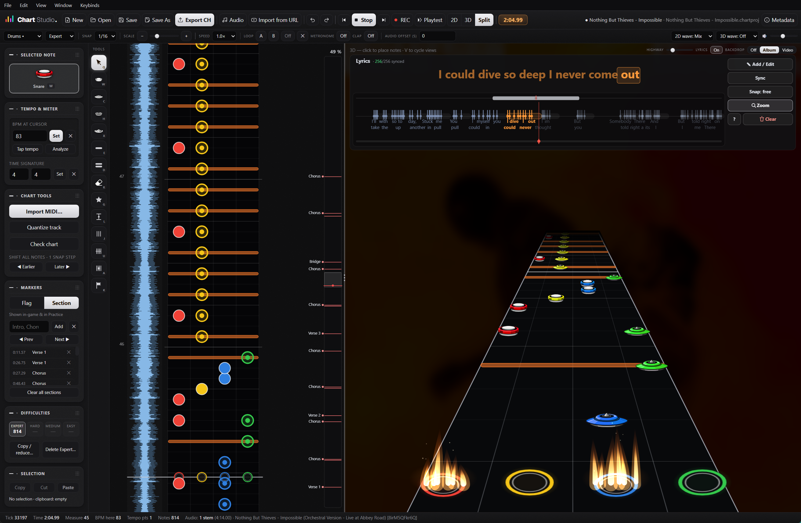

# Clone Hero Chart Studio (CHS)

A desktop app for **Windows** and **macOS** for creating and editing
[Clone Hero](https://clonehero.net) charts — drums and 5-fret guitar/bass — running on its own
engine. No Unity, no third-party editor code: the whole editor is a dependency-free vanilla JS
renderer inside an Electron shell.



Sister project to [Clone Hero Chart Manager](https://github.com/xlzipx/clone-hero-chart-manager).

> Not affiliated with or endorsed by Clone Hero.

---

## Features

### Instruments

- **Drums (4-lane, Pro Drums)** — toms and cymbals, ghost notes, accents, 2× kick,
  drum rolls (single and special), SP activation fills.
- **5-fret guitar / bass** — strum, HOPO and tap notes, open notes, sustains by dragging,
  forced strum/HOPO. Rhythm, co-op and keys tracks too.
- Four difficulties per instrument, each edited on its own.

### Views

- **2D** — top-down lane view with a waveform strip; precise, shows exactly where a note snapped.
- **3D** — game-like highway with note textures, hit flames and a strikeline.
- **Split** — both at once, with a draggable divider.
- **Song map** — a vertical overview of the whole song beside the 2D view: sections, flags,
  Star Power, solos, fills and rolls, the range you are currently looking at, and how far you
  are in percent. Click or drag it to jump anywhere.

### Audio

- Multiple stems (drums, bass, guitar, vocals…), each with its own volume and mute.
- Waveform drawn from RMS *and* peaks, so individual hits stand out instead of forming one
  solid block. Available in the 2D strip and on the 3D highway, per stem.
- Playback speed, A–B loop, metronome and note claps — the last two with their own volume,
  separate from the song.
- Output latency is compensated automatically, plus a manual A/V calibration offset.
- Load audio from a file, or pull it straight from a URL with yt-dlp — audio only, or audio
  plus a background video that plays behind the 3D highway.

### Charting tools

- Snap grid from 1/1 to 1/64 or free, plus quantize for a whole track.
- Tap tempo, a spectral-flux BPM analyser, BPM and time-signature markers, tempo anchors.
- Sections (shown in-game and in Practice mode) and flags (editor-only reminders).
- **Live record** — play along and tap the lanes to place notes as the song runs.
- **Playtest** — play your own chart with hit windows, combo and accuracy.
- **Copy / reduce difficulty** — generate Hard, Medium or Easy from Expert. Notes are thinned,
  never moved: on Hard each drum limb keeps its own rhythm, lower down the backbeat survives.
- **Check chart** — a linter that lists problems and jumps you to each one.
- **Lyrics editor** — syllable by syllable, with a karaoke line, a zoomable timeline and sync mode.
- Import notation from a `.mid` file and turn it into notes, tempo and time signatures included.
- Undo and redo throughout; select a range to copy, cut, paste or move it.

### Files

- Opens **`.chartproj`** — its own project format, with the chart, audio stems, background
  video, album art and your editing position packed into a single file — plus `.chart`,
  `.mid`, `.sng` and whole song folders.
- Exports a ready-to-play **Clone Hero song folder**, or `.sng`, `.mid`, `.chart`.
  Stems stay separate on export, and audio that has not been changed is passed through
  without re-encoding.

---

## Install

Download the installer from
[Releases](https://github.com/xlzipx/clone-hero-chart-studio/releases) and run it.

### Windows

`ChartStudio-Setup-<version>.exe` — the app is not signed with a paid certificate, so Windows
may warn that the publisher is unknown; choose *More info → Run anyway*.

### macOS

Two builds, pick the one that matches your Mac:

- `ChartStudio-<version>-arm64.dmg` — Apple Silicon (M1 and newer)
- `ChartStudio-<version>-x64.dmg` — Intel Macs

The build is ad-hoc signed but not notarised, so the first launch needs a right-click →
*Open* (Gatekeeper otherwise refuses to open an app from an unidentified developer). After that,
double-click works as usual.

### Build it yourself

```bash
cd app
npm install
npm run dev         # run from source (any platform)
npm run dist        # Windows: build the NSIS installer into app/dist
npm run dist:mac    # macOS:   build a .dmg into app/dist
```

Requires Node.js. `npm run dist:mac` needs a Mac, and the release workflow
(`.github/workflows/build-macos.yml`) does that automatically in the cloud on every version tag.

---

## Using the app

1. **New chart**, or open an existing song, then **Load audio…** (or *Import from URL*).
2. Set the tempo — *Tap tempo* or *Analyze* in the Tempo & meter panel — and place a BPM marker.
3. Pick an instrument and difficulty, choose a tool from the palette and click on the highway
   to place notes. Middle-drag anywhere to pan.
4. Add sections so the chart is navigable in Practice mode.
5. **Playtest** it, fix whatever does not feel right, then **Export CH** into your Songs folder.

Press <kbd>F1</kbd> for the full list of keyboard shortcuts.

---

## Layout

```
app/
  package.json          electron + electron-builder (NSIS installer)
  src/main.js           main process: window, native dialogs, menu, unsaved-changes guard
  src/preload.js        contextBridge API (window.forge)
  src/renderer/         the editor itself — one index.html, zero dependencies
assets/                 source artwork (logo, tool icons)
sample/notes.chart      test chart used by the smoke test
```

The renderer also runs standalone in a browser: native dialogs are feature-detected through
`window.forge`, and without them it falls back to file inputs and download-based export.

---

## License

The app code is [MIT licensed](LICENSE).

The installer bundles Electron and Chromium, whose licenses ship next to the executable as
`LICENSE.electron.txt` and `LICENSES.chromium.html`. Note textures and tool icons are original
artwork drawn for this project. yt-dlp is downloaded on demand at runtime and is not bundled.

---

## About

This is a fan project. I chart songs for Clone Hero myself, and I wanted an editor that felt
more intuitive and more fun to work in. I also wanted a few things the usual tools leave out,
where you normally end up switching between separate programs: pulling audio straight from a
link, syncing lyrics, putting a video behind the highway, or playtesting your own chart without
leaving the editor.

To be upfront about it, and as my bio says: I am not a programmer. I am a player with ideas,
and Claude Code helps me turn them into something that actually runs. So expect a rough edge
here and there.

It is free and open source. If you try it and something feels off, or there is a feature you
are missing, I would be glad to hear about it. Open an
[issue](https://github.com/xlzipx/clone-hero-chart-studio/issues).

— **ZIPEEK**
